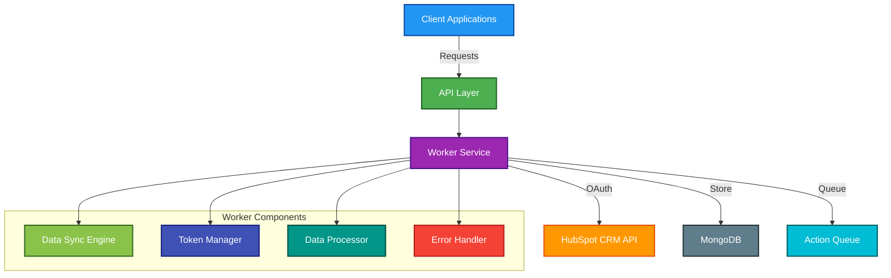
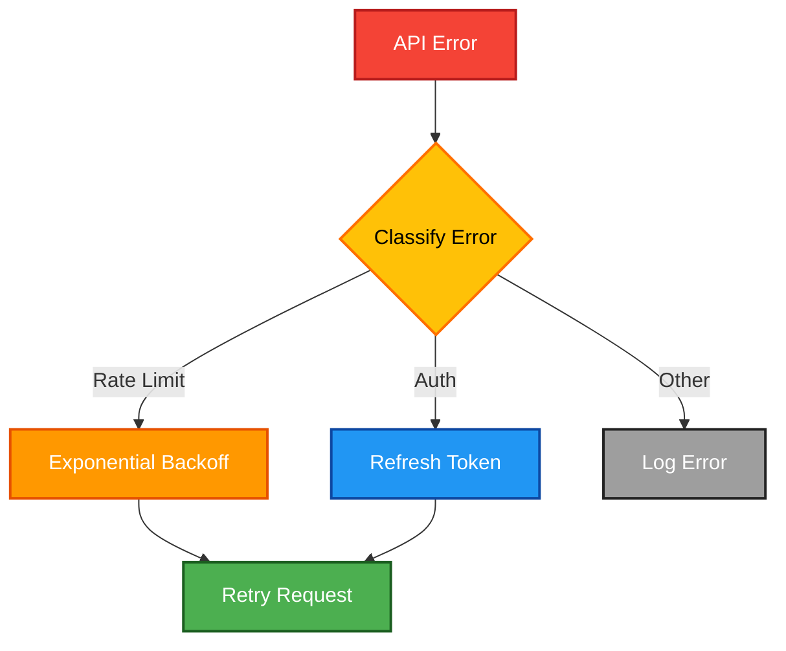
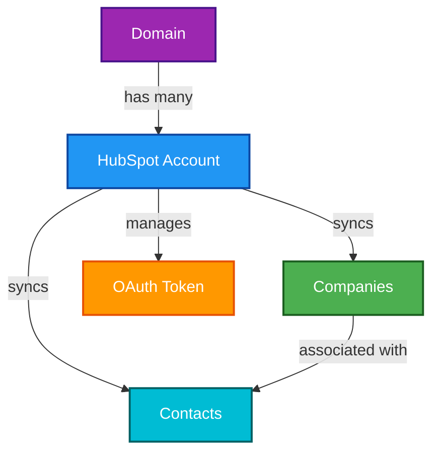
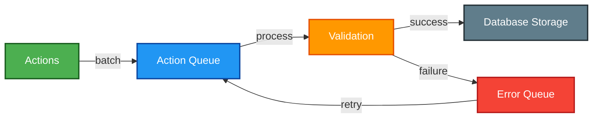
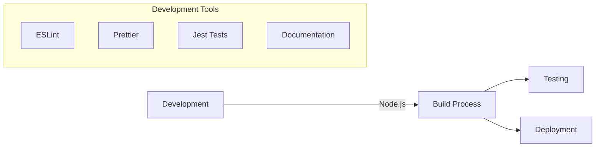

# HubSpot Integration Service - Architecture Overview

## Introduction
This service is a Node.js-based integration layer that synchronizes data between HubSpot's CRM and our system. It's designed to handle large-scale data processing with reliability and efficiency, focusing on company and contact data synchronization.

## High-Level Architecture



## Key Components

### 1. Data Sync Engine


### 2. Data Processing Pipeline


### 3. Error Handling & Resilience


### 4. Data Model Relationships


### 5. Queue Processing System


## Technology Stack
- **Runtime Environment**: Node.js
- **Database**: MongoDB
- **External API**: HubSpot CRM API v3
- **Authentication**: OAuth 2.0
- **Queue System**: In-memory with batch processing

## Component Responsibilities

### Worker Service
- Manages data synchronization lifecycle
- Handles rate limiting and retries
- Processes data transformations
- Creates appropriate actions

### Queue System
- Buffers actions before database insertion
- Handles batch processing
- Manages memory usage
- Ensures data consistency

### Domain Model
- Stores integration configuration
- Tracks synchronization state
- Manages OAuth tokens
- Handles multi-tenant data separation

## Development Environment


## Project Structure
```
hubspot-integration/
├── app.js                    # Application entry point
├── worker.js                 # HubSpot sync worker
├── server.js                 # API server implementation
├── Domain.js                 # Data models and schema
├── utils/                    # Utility functions
│   └── index.js             # Exported utilities
├── docs/                     # Documentation
│   ├── api/                 # API documentation
│   ├── guides/             # User guides
│   └── architecture/       # Architecture docs
└── tests/                   # Test files
```

## Performance Considerations
- Batch processing for efficient API usage
- Rate limit handling with exponential backoff
- Memory management for large datasets
- Connection pooling for database operations
- Caching of frequently accessed data

## Monitoring & Logging
- API call tracking
- Sync operation metrics
- Error rate monitoring
- Performance metrics
- Data processing statistics

## Security
- OAuth token management
- Secure credential storage
- API access control
- Data validation
- Error handling security 